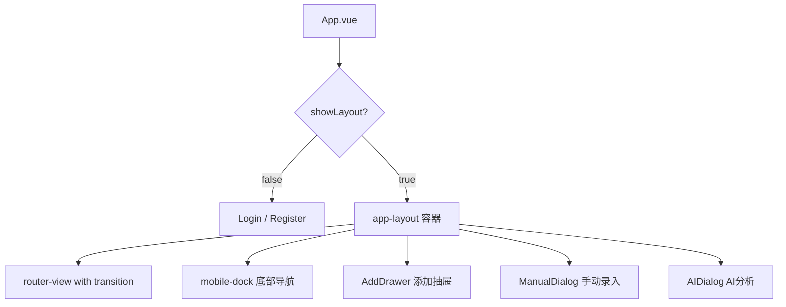

# 底部导航布局重构方案

## 一、问题诊断

### 🔴 致命 Bug：`RecipeLibrary.vue` 缺少 `userStore` 导入

这是**页面消失的直接原因**。

在 [`RecipeLibrary.vue`](src/views/RecipeLibrary.vue:12) 的模板和 [`canEdit` 计算属性](src/views/RecipeLibrary.vue:166) 中引用了 `userStore.role`，但 `<script setup>` 中**从未导入 `useUserStore`**：

```javascript
// src/views/RecipeLibrary.vue 第119-127行
import { ref, computed, onMounted, watch } from 'vue'
import { useRouter, useRoute } from 'vue-router'
import { useDietStore } from '../stores/diet'
// ❌ 缺少: import { useUserStore } from '../stores/user'
// ❌ 缺少: const userStore = useUserStore()
```

**后果链**：点击"食谱库" → 路由切换到 `/recipes` → Vue 渲染 `RecipeLibrary` 组件 → 遇到 `userStore.role` → 抛出 `ReferenceError: userStore is not defined` → **组件渲染崩溃** → 由于 `<transition>` 动画和 `:key` 机制，崩溃的组件卡住，后续导航全部失效。

---

### 🟡 架构级设计缺陷

#### 缺陷 1：无嵌套路由布局 — App.vue 承担了过多职责

**当前结构**（扁平路由 + 条件渲染）：



**问题**：
- [`App.vue`](src/App.vue) 有 **392 行**，包含大量业务逻辑：添加食物、AI 分析、手动录入等
- 使用 `v-if/v-else` 切换布局，意味着切换认证状态时**整个 DOM 树被销毁重建**
- [`showLayout`](src/App.vue:176) 依赖 `route.name` 检查，任何新增路由都需要手动维护白名单
- 一个组件崩溃会导致整个布局（包括底部导航）一起消失

#### 缺陷 2：底部导航 active 状态逻辑混乱

```html
<!-- 食谱按钮：手动 :class 绑定 -->
<router-link to="/recipes" :class="{ active: $route.path === '/recipes' && $route.query.tab !== 'fav' }">

<!-- Profile按钮：竟然也监听了 /recipes 路由的 query -->
<router-link to="/profile" :class="{ active: $route.path === '/profile' || ($route.path === '/recipes' && $route.query.tab === 'fav') }">
```

- [`active-class`](src/App.vue:28) 原生属性和手动 [`:class`](src/App.vue:44) 绑定**混用**
- Profile 按钮的激活状态居然依赖 `/recipes?tab=fav`，造成**强耦合**
- 极容易因为路径或查询参数变化而出 bug

#### 缺陷 3：跨组件通信使用 localStorage

[`Dashboard.vue`](src/views/Dashboard.vue:262) 通过 `localStorage.setItem('planning_meal_type', ...)` 传递状态给 [`RecipeLibrary.vue`](src/views/RecipeLibrary.vue:156)。这不是响应式的，且容易残留脏数据。

#### 缺陷 4：Transition 吞噬渲染错误

```html
<router-view v-slot="{ Component }">
  <transition name="fade-slide" mode="out-in">
    <div :key="$route.path" class="view-container">
      <component :is="Component" />
    </div>
  </transition>
</router-view>
```

当 [`<component :is="Component" />`](src/App.vue:19) 内部组件渲染失败时，`<transition>` 的 `mode="out-in"` 会等待离场动画完成才进入新组件。但崩溃的组件无法正常完成离场，导致**路由导航永久卡死**。

---

## 二、重构方案

### 目标架构

```mermaid
graph TD
    A[App.vue - 极简壳] --> B[router-view]
    B --> C[/login - Login.vue]
    B --> D[/register - Register.vue]
    B --> E["/ - MainLayout.vue 布局组件"]
    E --> F[嵌套 router-view]
    E --> G[BottomNav.vue 底部导航]
    F --> H[/dashboard - Dashboard.vue]
    F --> I["默认子路由 - DietTracker.vue"]
    F --> J[/recipes - RecipeLibrary.vue]
    F --> K[/profile - UserProfile.vue]
```

### 步骤详解

#### 步骤 1：紧急修复 — RecipeLibrary.vue 补全 userStore

在 `<script setup>` 中添加缺失的导入：

```javascript
import { useUserStore } from '../stores/user'
const userStore = useUserStore()
```

这一步可以**立即解决页面消失**的问题。

#### 步骤 2：创建 `MainLayout.vue` 布局组件

将 [`App.vue`](src/App.vue) 中的布局相关代码（底部导航、背景特效、全局对话框）抽取到新组件 `src/layouts/MainLayout.vue`：

**职责划分**：
| 组件 | 职责 |
|------|------|
| `App.vue` | 仅包含 `<router-view />`，不超过 10 行 |
| `MainLayout.vue` | 布局框架：顶部区域 + 内容滚动区 + 底部导航 |
| `BottomNav.vue` | 底部导航栏，纯展示 + 路由跳转 |
| `AddFoodSheet.vue` | 添加食物的抽屉 + 对话框逻辑 |

#### 步骤 3：重构路由为嵌套结构

```javascript
const routes = [
  {
    path: '/login',
    name: 'Login',
    component: () => import('../views/Login.vue'),
    meta: { guest: true }
  },
  {
    path: '/register',
    name: 'Register',
    component: () => import('../views/Register.vue'),
    meta: { guest: true }
  },
  {
    path: '/',
    component: () => import('../layouts/MainLayout.vue'),
    meta: { requiresAuth: true },
    children: [
      {
        path: '',
        name: 'Diet',
        component: () => import('../views/DietTracker.vue'),
        meta: { title: '饮食记录' }
      },
      {
        path: 'dashboard',
        name: 'Dashboard',
        component: () => import('../views/Dashboard.vue'),
        meta: { title: '仪表盘' }
      },
      {
        path: 'recipes',
        name: 'Recipes',
        component: () => import('../views/RecipeLibrary.vue'),
        meta: { title: '食谱库' }
      },
      {
        path: 'profile',
        name: 'Profile',
        component: () => import('../views/UserProfile.vue'),
        meta: { title: '个人中心' }
      },
      {
        path: 'admin',
        name: 'Admin',
        component: () => import('../views/AdminDashboard.vue'),
        meta: { requiresAdmin: true, title: '管理后台' }
      }
    ]
  }
]
```

**优势**：
- 登录/注册页面**天然不包含**底部导航，无需条件判断
- 新增需要底部导航的页面只需在 `children` 里加一条
- 布局组件独立，一个子页面崩溃不会连累导航栏

#### 步骤 4：提取 `BottomNav.vue` 组件

```html
<template>
  <nav class="mobile-dock">
    <router-link
      v-for="item in navItems"
      :key="item.path"
      :to="item.path"
      class="dock-item"
      active-class="active"
      :exact="item.exact"
    >
      <component :is="item.icon" />
    </router-link>
  </nav>
</template>
```

- **统一使用 `active-class`**，删除所有手动 `:class` 绑定
- 不再让 Profile 的高亮状态依赖 `/recipes` 的查询参数
- 中间的"+"按钮单独处理，不参与路由匹配

#### 步骤 5：用 Pinia Store 替代 localStorage 跨组件通信

将 `planning_meal_type` 从 localStorage 移入 [`diet.js` store](src/stores/diet.js) 中（实际上 `pendingMealContext` 已经存在，应统一使用）。

#### 步骤 6：添加 ErrorBoundary 防止组件崩溃扩散

在 `MainLayout.vue` 的 `<router-view>` 外层添加 Vue `onErrorCaptured` 钩子或 `<Suspense>` + 错误边界，防止子组件的渲染错误导致整个布局崩溃。

---

## 三、文件变更清单

| 操作 | 文件路径 | 说明 |
|------|----------|------|
| **修改** | `src/views/RecipeLibrary.vue` | 补全 userStore 导入（紧急修复） |
| **新建** | `src/layouts/MainLayout.vue` | 新布局组件，从 App.vue 迁移布局代码 |
| **新建** | `src/components/BottomNav.vue` | 底部导航独立组件 |
| **新建** | `src/components/AddFoodSheet.vue` | 添加食物抽屉和对话框 |
| **重写** | `src/App.vue` | 精简为只有 `<router-view />` |
| **重写** | `src/router/index.js` | 改为嵌套路由结构 |
| **修改** | `src/stores/diet.js` | 删除 localStorage 通信，统一用 store |
| **修改** | `src/views/Dashboard.vue` | 删除 localStorage 调用，改用 store |

---

## 四、风险与注意事项

1. **迁移顺序很重要**：建议先做步骤 1 紧急修复，确认页面恢复正常后再做架构重构
2. **provide/inject 需要调整**：当前 `openGlobalAdd` 和 `openEditFood` 通过 App.vue provide，重构后需要从 MainLayout.vue provide
3. **CSS 样式迁移**：App.vue 中的全局样式（非 scoped）需要保留在 App.vue 或移到单独的全局 CSS 文件中
4. **transition 动画**：建议在 `<router-view>` 的 transition 中添加 `onErrorCaptured` 保护，或在开发阶段暂时去掉 transition 以减少调试复杂度
